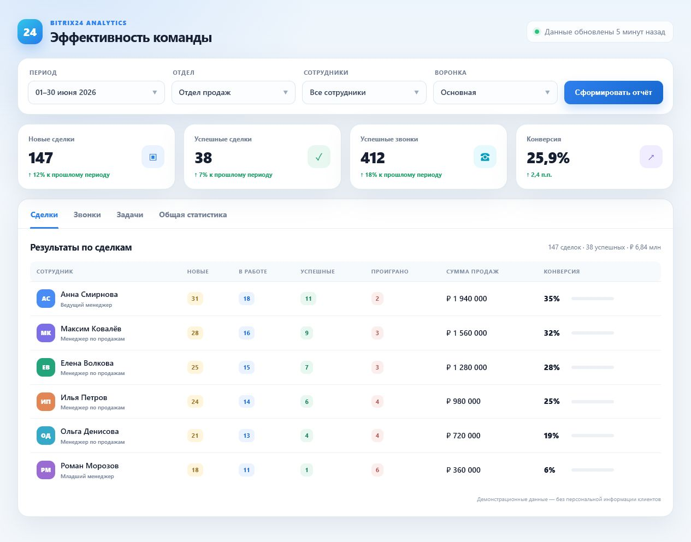
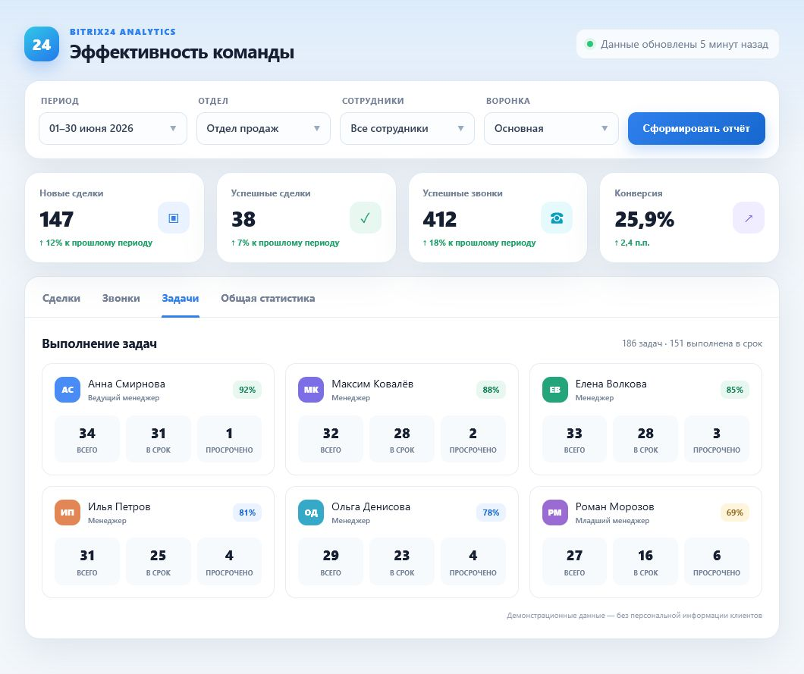
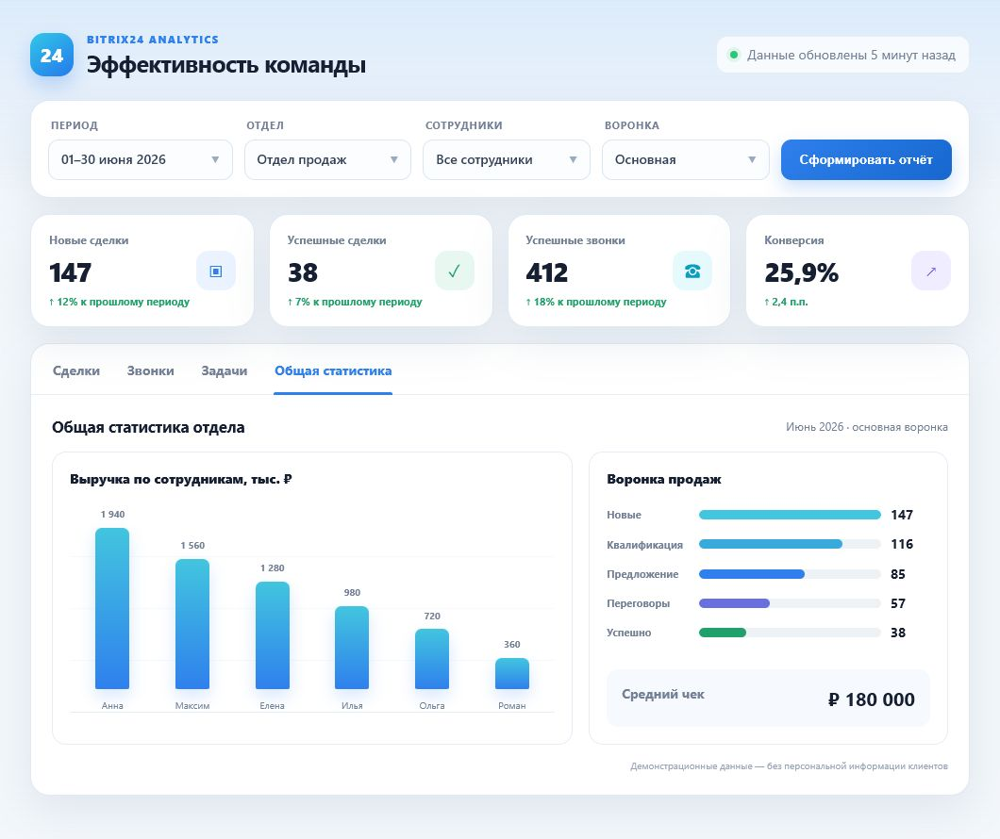

# Bitrix24 Employee Performance Dashboard

A reporting dashboard for reviewing employee activity and CRM results from Bitrix24.

The project was created to combine deals, calls, tasks and performance indicators in one interface with filters and visual summaries.

## Features

- filter reports by date range, manager, department and sales pipeline;
- review deal stages and lead activity;
- compare total and successful calls and call duration;
- monitor current, old and overdue tasks;
- calculate conversion and workload indicators;
- display summary charts and employee tables;
- refresh information from the Bitrix24 REST API.

## Screenshots

The interface below is shown with sanitized demo data. No real customer or employee information is included.

### Deals overview

### Task performance

### Team analytics

## Repository contents

- `dashboard.html` — standalone dashboard prototype;
- `reports.vue` — Vue component version of the reporting interface.

## Tech stack

- Vue 3
- JavaScript
- Bitrix24 REST API
- Axios
- Bootstrap
- Chart.js
- Flatpickr
- Moment.js

## Status

Legacy integration prototype. Before it can be used as a public demo, the Bitrix24 endpoint must be moved to environment-based configuration and the interface must be connected to sanitized mock data.

## Planned portfolio update

- remove integration credentials from the complete Git history;
- add a `.env.example` for local configuration;
- add a mock-data mode;
- document how the Vue component is mounted;
- add a short filtered-report demonstration.

## Security note

Never commit a Bitrix24 webhook or access token. Treat a webhook as a password, keep it outside the frontend bundle and rotate it if it has ever been published.
